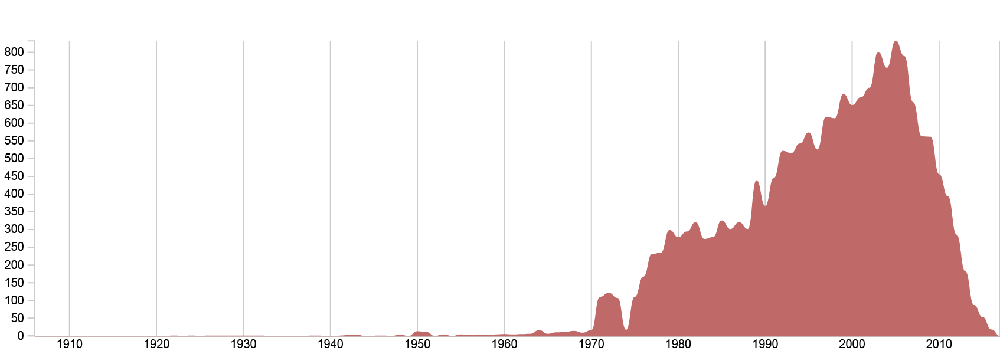

Wikidata is massive database of information encoded as linked open data. In our opinion, this is an incredible project, that surely will heavily influence the field of data visualisation (and not only this). During the <a href="https://meta.wikimedia.org/wiki/WikiCite_2017" target="_blank" rel="noopener">Wikicite Hackathon</a> conference, we had a chance to meet some of the great people beyond the project, and after the event, we immediately started to experiment on how to visualise this data.

&nbsp;

# Wikidata in a nutshell

What do we mean with &#8220;a huge database of information encoded as linked open data&#8221;? Basically, each item represents a **concept** identified by a **unique ID**, such as “[Earth](https://www.wikidata.org/wiki/Q2)” identified by &#8220;Q2&#8221;, “[Human being](https://www.wikidata.org/wiki/Q5)” by &#8220;Q5&#8221; or “[Nelson Mandela](https://www.wikidata.org/wiki/Q8023)” by &#8220;Q8023&#8221;. Items are connected between each others through their **properties**: the item Q8023 “[Nelson Mandela](https://www.wikidata.org/wiki/Q8023)” is an instance of the item “[Human being](https://www.wikidata.org/wiki/Q5)”, and its place of birth is “[Mvezo](https://www.wikidata.org/wiki/Q1020378)” which is part of “[South Africa](https://www.wikidata.org/wiki/Q258)”, which is itself connected to other items through other properties.

To put it in simple words, Wikidata is nothing but a huge network of connected items that we are able to query in order to extract data of different kinds and with different structures.

To make an example, we could ask it to return all the <a href="https://query.wikidata.org/#SELECT%20%3Fhuman%20%3FhumanLabel%0AWHERE%0A%7B%0A%09%3Fhuman%20wdt%3AP31%20wd%3AQ5%0A%09SERVICE%20wikibase%3Alabel%20%7B%20bd%3AserviceParam%20wikibase%3Alanguage%20%22en%22%20%7D%0A%7D%0A%0ALIMIT%201000" target="_blank" rel="noopener">instances of human beings</a>, and for each of them the <a href="https://query.wikidata.org/#SELECT%20%3Fhuman%20%3FhumanLabel%0AWHERE%0A%7B%0A%09%3Fhuman%20wdt%3AP31%20wd%3AQ5%20.%20%0A%20%20%20%20%3Fhuman%20wdt%3AP569%20%3FbirthDate%20.%20%0A%20%20%20%20BIND%28%20year%28%3FbirthDate%29%20as%20%3FbirthYear%20%29%0A%09SERVICE%20wikibase%3Alabel%20%7B%20bd%3AserviceParam%20wikibase%3Alanguage%20%22en%22%20%7D%0A%7D%0A%0ALIMIT%201000" target="_blank" rel="noopener">birth year</a>.

&nbsp;

# Querying the database

Wikidata provide graphic interface for performing queries using the <a href="https://www.wikidata.org/wiki/Wikidata:SPARQL_query_service" target="_blank" rel="noopener">SPARQL language</a>, which is quite particular. Although is not a dramatically easy to search for something using this language, just keep in mind the same basic concept of before, which is that items on Wikidata are linked by properties.

<pre>subject → property → object</pre>

&nbsp;

Let&#8217;s make an example:

<pre><a href="https://www.wikidata.org/wiki/Q8023">Nelson Mandela</a> → <a title="Property:P19" href="https://www.wikidata.org/wiki/Property:P19">place of birth</a> → <a title="Q1020378" href="https://www.wikidata.org/wiki/Q1020378">Mvezo</a>
<em>subject          property         object</em></pre>

In this case, the two different objects – the person N. Mandela on the left and the place Mvezo on the right – are linked by the property &#8220;place of birth&#8221;.

&nbsp;

Furthermore, the SPARQL language allows to make _variable_ part of those parameters, for example:

<pre><strong>?people</strong> → <a title="Property:P19" href="https://www.wikidata.org/wiki/Property:P19">place of birth</a> → <a title="Q1020378" href="https://www.wikidata.org/wiki/Q1020378">Mvezo</a>
<em>variable  property         object</em></pre>

Do you notice the word &#8220;people&#8221; preceded by the question mark? This is a variable object that Wikidata will &#8220;fill up&#8221; with the values if finds. For instance, thanks to <a href="https://query.wikidata.org/#SELECT%20DISTINCT%20%3FpeopleLabel%0AWHERE%0A%7B%0A%20%20%20%20%20%20%20%3Fpeople%20wdt%3AP19%20wd%3AQ1020378%0A%20%20%20%20%20%20%20SERVICE%20wikibase%3Alabel%20%7Bbd%3AserviceParam%20wikibase%3Alanguage%20%22fr%2Cen%22%20%7D%0A%7D" target="_blank" rel="noopener">this formula,</a> we can query any &#8220;object&#8221; in Wikidata that &#8220;was born&#8221; in the village of Mvezo and Nelson Mandela seems to be the only one born there – considering the data available.

On Wikidata you can even formulate more complex queries, asking for a list of elements depending on multiple properties of your choice, such as all the people and their year of birth who were born in Milan and that were politician. Something like this:

<pre><strong>?person</strong> → <a title="Property:P19" href="https://www.wikidata.org/wiki/Property:P19" target="_blank" rel="noopener">place of birth</a> → <a title="Q1020378" href="https://www.wikidata.org/wiki/Q490" target="_blank" rel="noopener">Milan</a>
<strong>?person</strong> → <a href="https://www.wikidata.org/wiki/Property:P106" target="_blank" rel="noopener">occupation</a>     → <a href="https://www.wikidata.org/wiki/Q82955" target="_blank" rel="noopener">politician</a>
<strong>?person</strong> → <a href="https://www.wikidata.org/wiki/Property:P569" target="_blank" rel="noopener">date of birth</a>  → <strong>?date</strong></pre>

Again, <a href="https://query.wikidata.org/#SELECT%20DISTINCT%20%3Fperson%20%3FpersonLabel%20%3FbirthYear%0AWHERE%0A%7B%0A%20%20%20%20%20%20%20%3Fperson%20wdt%3AP19%20wd%3AQ490%20.%20%0A%20%20%20%20%20%20%20%3Fperson%20wdt%3AP569%20%3FbirthDate%20.%0A%20%20%20%20%20%20%20%3Fperson%20wdt%3AP106%20wd%3AQ82955%0A%20%20%20%20%20%20%20BIND%28%20year%28%3FbirthDate%29%20as%20%3FbirthYear%20%29%0A%20%20%20%20%20%20%20SERVICE%20wikibase%3Alabel%20%7Bbd%3AserviceParam%20wikibase%3Alanguage%20%22en%22%20%7D%0A%7D" target="_blank" rel="noopener">look at the query</a> to see the data.

&nbsp;

# Musical bands on Wikidata

Excited by the possibilities offered by Wikidata, we made a first query asking all the bands available on Wikidata (<a href="https://query.wikidata.org/#SELECT%20%3Fyear%20%28COUNT%28%3Fitems%29%20AS%20%3Fcount%29%0AWHERE%20%7B%0A%20%20%3Fitems%20wdt%3AP31%20wd%3AQ215380%20.%20%23%20get%20things%20that%20are%20bands%0A%20%20%3Fitems%20wdt%3AP571%20%3Fdate%20.%20%23%20get%20the%20date%20when%20the%20band%20was%20founded%0A%20%20%0A%20%20BIND%28%20year%28%3Fdate%29%20as%20%3Fyear%20%29%20%23%20aggregate%20data%20by%20year%0A%20%20FILTER%20%28%3Fyear%20%3E%201900%29%20%23filter%20on%20the%20last%20century%0A%20%20SERVICE%20wikibase%3Alabel%20%7B%0A%20%20%20%20bd%3AserviceParam%20wikibase%3Alanguage%20%22en%22%20.%20%23get%20labels%20in%20english.%0A%20%20%20%20%23with%20this%20service%2C%20you%20can%20add%20%22Label%22%20suffix%20to%20any%20variable.%0A%20%20%7D%0A%7D%0A%0AGROUP%20BY%20%3Fyear" target="_blank" rel="noopener">query</a>). **How many bands are present on Wikidata, and how are they distributed over time?**  

After a first attempt, as usually happens in these situations, we found errors and inconsistencies, like bands created in 196 b.c. or millennia before Christ. It is interesting to notice that it is possible to come up with the correct data after a quick research on the web and that Wikidata enables you to go and fix those mistakes almost instantly. So if you are excited by the the idea of giving your contribution to the giant database, you really have to look into it.

A part from this fact, for our exploration we decided to focus on contemporary music, so we cut the data only to the last century. As you can probably imagine, there is a rising trend – apart 1974, what happened that year? – and a constant decreasing after 2005 – we believe that this is partly due to the fact that the most recent musical band formed still needs to make their way to success and so to Wikidata.

Afterwards, the question we asked ourselves was: **to which genres do these bands belongs?** Easily, instead of the year of foundation, we can query Wikidata for genre property. <a href="https://query.wikidata.org/#SELECT%20%3FgenreLabel%20%28COUNT%28%3Fitems%29%20AS%20%3Fcount%29%0AWHERE%20%7B%0A%20%20%3Fitems%20wdt%3AP31%20wd%3AQ215380%20.%20%23%20get%20things%20that%20are%20bands%0A%20%20%3Fitems%20wdt%3AP136%20%3Fgenre%20.%20%23%20get%20the%20genre%20of%20the%20band%0A%20%20SERVICE%20wikibase%3Alabel%20%7B%0A%20%20%20%20bd%3AserviceParam%20wikibase%3Alanguage%20%22en%22%20.%20%23get%20labels%20in%20english.%0A%20%20%20%20%23with%20this%20service%2C%20you%20can%20add%20%22Label%22%20suffix%20to%20any%20variable.%0A%20%20%7D%0A%7D%0A%0AGROUP%20BY%20%3FgenreLabel" target="_blank" rel="noopener">Here is the query</a>, and following is the bubble chart representing them.

793 results in less than 10 seconds, without this collaborative miracle gathering this data could have taken years of research on magazines, webzines and other kind of publications, awesome. Of course, things such as Alternative Rock, Punk Rock, Rock and Pop music are taking over the scene, but we are still able to see less major genres such as J-pop, Tecno, Technical Death Metal or Cowpunk, Afrobeat or Raggaeton.

Since the genres are so many we have to drill down on the main ones to continue the exploration, so we kept only the top 20 ranking them by total amount of belonging bands. After this selection has been made, we went on with our exploration: **how do genres evolve during time?** For each band it is possible to query multiple data, in this case we wanted the year and the genre for each band. [Here is the query](https://query.wikidata.org/#SELECT%20%3Fyear%20%28COUNT%28%3Fgenre%29%20AS%20%3Fcount%29%20%3FgenreLabel%20%23%20%28SAMPLE%28%3FgenreLabel%29%20AS%20%3FgenreLabel%29%0AWHERE%20%7B%0A%20%20%3Fitems%20wdt%3AP31%20wd%3AQ215380%20.%20%23get%20things%20that%20are%20bands%0A%20%20%3Fitems%20wdt%3AP571%20%3Fdate%20.%20%23get%20the%20date%20when%20the%20band%20was%20founded%0A%20%20%3Fitems%20wdt%3AP136%20%3Fgenre%20.%20%23get%20the%20genre%20of%20the%20band%0A%20%20%3Fgenre%20rdfs%3Alabel%20%3FgenreLabel.%20%23get%20the%20label%20for%20the%20genre%0A%20%20FILTER%28%28LANG%28%3FgenreLabel%29%29%20%3D%20%22en%22%29%20%23keep%20only%20english%20labels%0A%20%20BIND%28%20year%28%3Fdate%29%20as%20%3Fyear%20%29%20%23group%20data%20by%20year%0A%20%20FILTER%20%28%3Fyear%20%3E%201900%29%20%23filter%20on%20bands%20founded%20after%201900%0A%7D%0A%0AGROUP%20BY%20%3Fyear%20%3FgenreLabel), following the visualisation:

&nbsp;

What we can see is that it seems that most of the genre had their hot moments in the history of music. New wave, for example, is concentrated across the &#8217;80s, while indie rock have seen its peak around 2005. Anyway, we have to keep in mind that we are looking at bands foundations, not bands activities: some lasted more than 40 years and produced many songs and many albums. The data underlying this first area graph doesn&#8217;t give us a good perspective on the **activity of each genre** so we performed a newer query addressed to find an answer to this question.

In Wikidata is possible to follow properties in order to add details to our dataset: we can ask the list of albums made by those bands and ask for the year in which they where produced. [Here is the query](https://query.wikidata.org/#%23%20album%20per%20genre%20over%20time%0A%23%20get%20album%20only%20from%20the%20instances%20of%20band%0A%0ASELECT%20%28SAMPLE%28%3FgenreLabel%29%20AS%20%3FgenreLabel%29%20%3Fyear%20%28COUNT%28%3Falbum%29%20AS%20%3Fcount%29%0AWHERE%20%7B%0A%20%20%3Falbum%20wdt%3AP31%20wd%3AQ482994%20.%20%23things%20that%20are%20albums%0A%20%20%3Falbum%20wdt%3AP577%20%3Fdate%20.%20%23get%20the%20publication%20date%0A%20%20%3Falbum%20wdt%3AP175%20%3Fperformer%20.%20%23get%20the%20performer%0A%20%20%3Fperformer%20wdt%3AP31%20wd%3AQ215380%20.%20%23get%20only%20album%20performed%20by%20a%20band%0A%20%20%3Falbum%20wdt%3AP136%20%3Fgenre%20.%20%23get%20the%20album%20genre%0A%20%20BIND%28%20year%28%3Fdate%29%20as%20%3Fyear%20%29.%20%23group%20data%20by%20year%0A%20%20%3Fgenre%20rdfs%3Alabel%20%3FgenreLabel.%20%23get%20labels%0A%20%20FILTER%28%28LANG%28%3FgenreLabel%29%29%20%3D%20%22en%22%29%20%23keep%20only%20english%20labels%0A%20%20FILTER%28%3Fyear%20%3E%201950%29%20%23filter%20on%20albums%20published%20after%201950%0A%7D%0A%0AGROUP%20BY%20%3FgenreLabel%20%3Fyear%0A).

Using albums as units, we have a different perspective on it: Punk Rock is now less relevant, while Prog-Rock seems to be more active, especially in the early &#8217;70s.

Finally, since there was a huge number of genres, we were curios to see if it is possible to **find a hierarchy** among them. Following the property &#8220;subclass of&#8221; it was possible for us to see how genres could be aggregated ([here is the query](https://query.wikidata.org/#SELECT%20DISTINCT%20%3FitemsLabel%20%3FparentLabel%0AWHERE%20%7B%0A%20%20%3Fitems%20wdt%3AP31%20wd%3AQ188451%20.%20%23%20get%20things%20that%20are%20music%20genres%0A%20%20%3Fitems%20wdt%3AP279%20%3Fparent%20.%20%23%20get%20the%20parent%20genre%20of%20the%20band%0A%20%20SERVICE%20wikibase%3Alabel%20%7B%0A%20%20%20%20bd%3AserviceParam%20wikibase%3Alanguage%20%22en%22%20.%20%23get%20labels%20in%20english.%0A%20%20%20%20%23with%20this%20service%2C%20you%20can%20add%20%22Label%22%20suffix%20to%20any%20variable.%0A%20%20%7D%0A%7D)).

This example of exploration is somehow useful for getting an idea of the potential of the database. As said at the beginning, learning how to correctly query the database is not a totally easy task, but after you manage to do so you can eventually go and explore several different fields: cinema, politics, literature or history and so on. You could even directly drill down to things relevant for you, depending on your interests: <a href="https://query.wikidata.org/#%23Airports%20within%20100km%20of%20Berlin%0A%23added%20before%202016-10%0A%20%0A%23defaultView%3AMap%0ASELECT%20%3Fplace%20%3FplaceLabel%20%3Flocation%0AWHERE%0A%7B%0A%20%20%23%20Berlin%20coordinates%0A%20%20wd%3AQ64%20wdt%3AP625%20%3FberlinLoc%20.%20%0A%20%20SERVICE%20wikibase%3Aaround%20%7B%20%0A%20%20%20%20%20%20%3Fplace%20wdt%3AP625%20%3Flocation%20.%20%0A%20%20%20%20%20%20bd%3AserviceParam%20wikibase%3Acenter%20%3FberlinLoc%20.%20%0A%20%20%20%20%20%20bd%3AserviceParam%20wikibase%3Aradius%20%22100%22%20.%20%0A%20%20%7D%20%0A%20%20%23%20Is%20an%20airport%0A%20%20%3Fplace%20wdt%3AP31%2Fwdt%3AP279%2a%20wd%3AQ1248784%20.%0A%20%20SERVICE%20wikibase%3Alabel%20%7B%0A%20%20%20%20bd%3AserviceParam%20wikibase%3Alanguage%20%22en%22%20.%20%0A%20%20%7D%0A%7D" target="_blank" rel="noopener">airports around Berlin</a>, <a href="https://query.wikidata.org/#%23Most%20beautiful%20villages%20of%20France%0A%23defaultView%3AMap%0ASELECT%20%3Fitem%20%3FitemLabel%20%3FgeoLoc%20%3Fimage%0AWHERE%0A%7B%0A%20%20%20%20%3Fitem%20wdt%3AP463%20wd%3AQ1010307%20.%20%20%20%0A%20%20%20%20%3Fitem%20wdt%3AP625%20%3FgeoLoc%20.%0A%20%20%20%20OPTIONAL%20%7B%20%3Fitem%20wdt%3AP18%20%3Fimage%20.%20%7D%0A%20%20%20%20SERVICE%20wikibase%3Alabel%20%7B%20bd%3AserviceParam%20wikibase%3Alanguage%20%22en%22%20%7D%0A%7D" target="_blank" rel="noopener">the most beautiful villages in France</a>, <a href="https://query.wikidata.org/#%23Birthplaces%20of%20astronauts%0A%23added%20before%202016-10%0A%0A%23%20select%20all%20astronauts%20with%20name%2C%20image%2C%20birthdate%2C%20birthplace%20and%20coordinates%20of%20the%20birthplace%0A%0ASELECT%20%3Fastronaut%20%3FastronautLabel%20%3Fimage%20%3Fbirthdate%20%3Fbirthplace%20%3Fcoord%20WHERE%20%7B%0A%20%20%3Fastronaut%20%3Fx1%20wd%3AQ11631%3B%0A%20%20wdt%3AP18%20%3Fimage%3B%0A%20%20wdt%3AP569%20%3Fbirthdate%3B%0A%20%20wdt%3AP19%20%3Fbirthplace.%0A%20%20%0A%20%20%3Fbirthplace%20wdt%3AP625%20%3Fcoord%0A%20%20SERVICE%20wikibase%3Alabel%20%7B%20bd%3AserviceParam%20wikibase%3Alanguage%20%22en%22.%20%7D%0A%7D%0AORDER%20BY%20DESC%28%3Fbirthdate%29" target="_blank" rel="noopener">birthplace of astronauts</a> or <a href="https://query.wikidata.org/#%23Eiffel%20Tower%20in%20art%0A%23added%20before%202016-10%0ASELECT%20DISTINCT%20%3Fitem%20%3FitemLabel%20%3FinstanceLabel%20%3FcreatorLabel%20%28YEAR%28%3Fdate%29%20as%20%3Fyear%29%20%3Fimage%0AWHERE%0A%7B%0A%20%20%3Fitem%20wdt%3AP180%20wd%3AQ243%20.%0A%20%20%3Fitem%20wdt%3AP31%20%3Finstance%20.%0A%20%20OPTIONAL%20%7B%20%3Fitem%20wdt%3AP170%20%3Fcreator%20%7D%0A%20%20OPTIONAL%20%7B%20%3Fitem%20wdt%3AP571%20%3Fdate%20%7D%0A%20%20OPTIONAL%20%7B%20%3Fitem%20wdt%3AP18%20%3Fimage%20%7D%0A%20%20SERVICE%20wikibase%3Alabel%20%7B%20bd%3AserviceParam%20wikibase%3Alanguage%20%22en%22%20.%20%7D%0A%7D%0AORDER%20BY%20%3FitemLabel" target="_blank" rel="noopener">where the Eiffel Tower shows up in famous paintings</a>.

We have just started to explore Wikidata and what we discovered is that it is far more bigger than we expected. Potentially, in the future, more and more things could have a corresponding record within the database, leading it to grow closer and closer to a digital representation of the human knowledge.

Willing to enable people to use and visualise this data more easily and more efficiently, we&#8217;re working on a new interesting feature for RAWGraphs, so stay tuned to discover more about it!

&nbsp;
