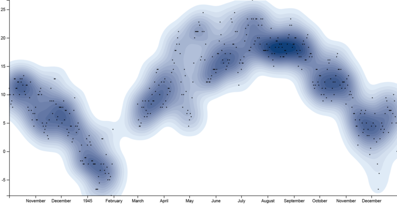

Today we are releasing a new version of RAWGraphs (1.3.0) that can be used on our website: app.rawgraphs.io.

The main improvement is the adoption of the d3.js 5.x version, all the charts has been rewrote accordingly.

This allowed us to add two new visual models: “bee swarm plot” and “contour plot”

* Bee swarm plot are useful to show distributions of item avoiding overlappings. If you want to learn how to create one with RAWGraphs, check this post: How to make a beeswarm plot.

    
    <small class="caption">A bee swarm plot representing Kickstarted campaigns. See how to create it <a href="/">here.</a></small>

* Contour plot show the estimated density of point clouds, which is especially useful to avoid overlappings in large datasets. If you want to learn how to create one with RAWGraphs, check this post: How to make a beeswarm plot.

    
    <small class="caption">A bee swarm plot representing Kickstarted campaigns. See how to create it <a href="/">here.</a></small>

