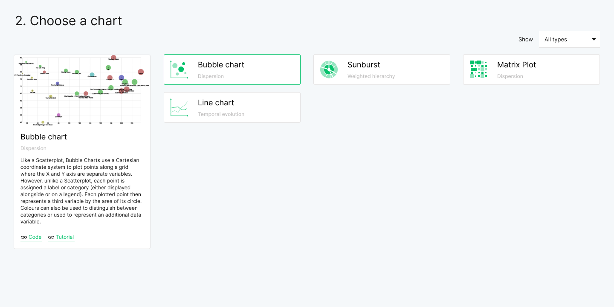
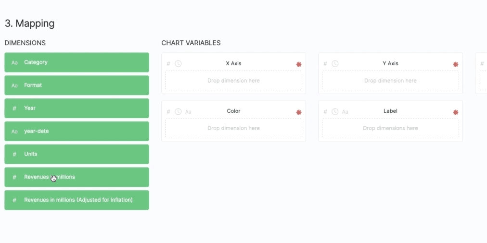
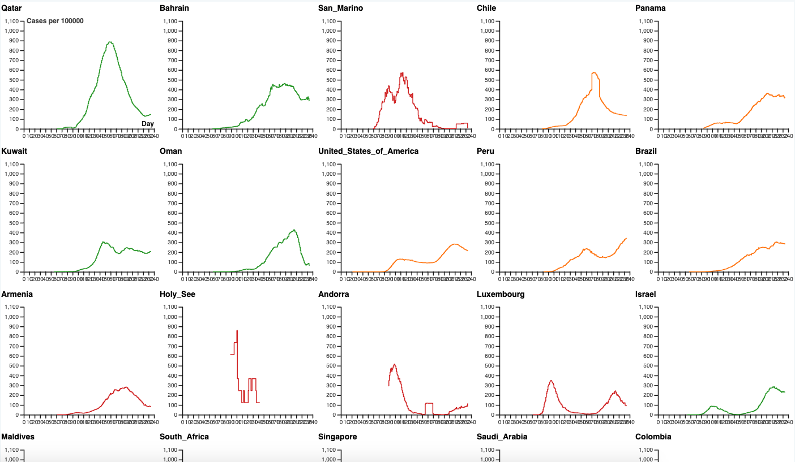
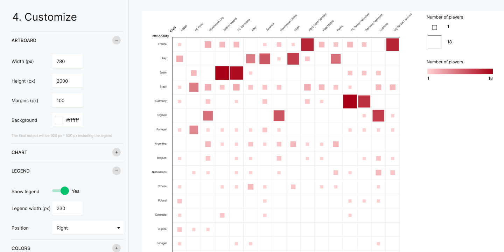

Yes, it’s true, it took a little bit more time than expected...but the first release of RAWGraphs 2.0 is coming!

In September we will drop the biggest update of RAWGraphs since 2017. As you know, it won’t be a simple update of the software with some new features, but a completely refactored version, from the core, the RAWGraphs library, to the interface.
*****
### What to expect in this first release?

## RAWGraphs Library

In the latest months, we have spent a lot of time defining and implementing a brand new RAWGraphs library. The new library is written in ES6 and makes use of updated releases of third parties libraries (like d3.js). Our goal is to have a more robust and flexible library to better handle the data input and ease the implementation of new features and new charts.

Thanks to the fact that the RAWGraphs library will be independent from the RAW application, it will be possible to use it in any web application created with html and javascript and to bring the simplicity, data mapping concepts and visual models of RAWGraphs to any other project.

The library will be released at a later time in a separate and dedicated repository and documentation about how to use it will follow.
*****
## Loading your data

In this first release we improved existing features and introduced some new ones to handle the data parsing. Here is what we will include in this first release:

-   Possibility to load tabular data (through copy and paste or from a file) and JSON files
-   Possibility to define the column, decimal and thousand separators in the parsing
-   Possibility to specify date locale to better handle dates that don’t follow english standards
-   Possibility to stack a data on a column
-   Possibility to specify and force the data type (dates, numbers, strings) of each column if needed
-   New data samples to test the app.

Other data inputs (URL, SPARQL queries and from a project) will be implemented in the next releases.
*****
## Charts

 

For this very first release we will include four charts, two of which are not in RAWGraphs 1.0:

-   Line chart (finally, right?)
-   Matrix plot
-   Bubble chart (previously called scatter plot)
-   Sunburst

New and “old” charts will be included in the coming releases, don’t worry!

*****
## Mapping the data

The brand new library unlocked new possibilities in the mapping process:

-   Possibility to define different ways to aggregate data (sum, average, median, min)
-   Possibility to create series (small multiples alike - check the image below)

We are also working hard to include the possibility to filter data in the future releases.
 

 

*****
## Charts options

 

In the past we have received a lot of feedback to improve the control over the graphical options of the charts. In this first release we will include:

-   The possibility to add a legend that can be exported with the chart
-   More control over margins, artboard and other graphic details

*****
## Exporting
For this first release, we won’t include new ways to export the charts, beside .svg and .png, but soon we will introduce the possibility to export the entire project. It means that you will be able to export, in one single file, the data and the settings so that you can share it with other users or open it again without losing the work done.
*****
## RAWGraphs front-end and UX/UI new design
With so many new features we had to redesign and develop a new front-end from scratch, keeping the ease of use of the previous versions. To do so, we went through a very iterative and agile process of design that will continue in the coming months while we introduce new features.

In terms of technological stack, for the front-end we decided to use React.js and Bootstrap.
*****
## Who can access RAWGraphs 2.0 alpha?
This version, and the following updates that will be released in the coming months, will be available only to backers who contributed with at least 50€ to our campaign. Once all the new features we promised will be implemented, RAWGraphs 2.0 will be available to everyone, for free of course.

If you don’t want to wait and get access to the new version, you can support us on Indiegogo.
