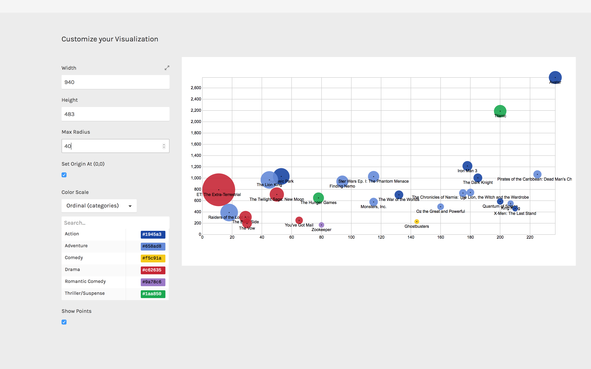

In RAWGraphs, scatterplot and bubble graph are presented as variants of the same layout. This layout is useful to see correlations among dimensions. In this example, we will use it to visualize some data related to a list of movies.

**GOAL OF THE TUTORIAL**: comparing movies according box office, production budget, return on investment and genre.

### 01. Load your data

The first step is to copy and paste your data into RAWGraphs.

The dataset must contain at least two columns, one for the X Axis (in our case, Production Budget) and one for the Y Axis (Box Office). Optionally, you can add a column for the Size (ROI), a column for the Color (Genre), and one or more for the label (Movie).

Here you can see the dataset we are going to use:

You can also download the dataset through the link on the left of this post or load the data from using the “Try our samples” button then choosing “Movies &#8211; Dispersion”.

In few second you should see the green bar saying “26 records in your data have been successfully parsed!”

### 02. Choose the scatter plot layout

After pasting your data, scroll down and select the “scatter plot” visual model.

 

### **03. Map your dimensions**

The scatterplot layout has five visual variables. 

<table>
  <tr>
    <td>
      <strong>VARIABLE</strong>
    </td>
    
    <td>
      <strong>TYPE</strong>
    </td>
    
    <td>
      <strong>REQUIRED</strong>
    </td>
    
    <td>
      <strong>MULTIPLE</strong>
    </td>
    
    <td>
      <strong>DESCRIPTION</strong>
    </td>
  </tr>
  
  <tr>
    <td>
      <strong>X Axis</strong>
    </td>
    
    <td>
      Number, date
    </td>
    
    <td>
      [fa class=&#8221;fa-asterisk&#8221;]
    </td>
    
    <td>
    </td>
    
    <td>
      The horizontal position of the circles.
    </td>
  </tr>
  
  <tr>
    <td>
      <strong>Y Axis</strong>
    </td>
    
    <td>
      Number, date
    </td>
    
    <td>
      [fa class=&#8221;fa-asterisk&#8221;]
    </td>
    
    <td>
    </td>
    
    <td>
      The vertical position of the circles.
    </td>
  </tr>
  
  <tr>
    <td>
      <strong>Size</strong>
    </td>
    
    <td>
      Number
    </td>
    
    <td>
    </td>
    
    <td>
    </td>
    
    <td>
      Area of the circles. If not provided, size will be proportional to the count of rows.
    </td>
  </tr>
  
  <tr>
    <td>
      <strong>Color</strong>
    </td>
    
    <td>
      String, numbers, dates
    </td>
    
    <td>
    </td>
    
    <td>
    </td>
    
    <td>
      For each unique value found in the dimension, a color is created.
    </td>
  </tr>
  
  <tr>
    <td>
      <strong>Label</strong>
    </td>
    
    <td>
      String, numbers, dates
    </td>
    
    <td>
    </td>
    
    <td>
      [fa class=&#8221;fa-tags&#8221;]
    </td>
    
    <td>
      Values will be used as labels. If more than one dimension is dragged, the label will contains the values separated by comma.
    </td>
  </tr>
</table>

  It’s time to map your data and create the visualization. On the left you have the list of dimensions in your dataset, on the right the available visual variable of the scatter plot layout. 

Drag and drop the dimensions as following:

  * Production budget as X Axis;
  * Box Office as Y Axis;
  * Roi as Size;
  * Genre as Color;
  * Movie as Label.

 

In this way we created a circle for each movie in the dataset, disposing it on the cartesian plane according to its production budget and its box office. We then set the area of each circle proportional to the ROI. We colored circles according to genres, and finally put the movie’s name as label.

### 04. Refine and export

To reach the final results we can customize the visualization with some parameters you can find next to the visualization. 

For the scatterplot the options available are the following:

&nbsp;

<table>
  <tr>
    <td>
      <strong>OPTION</strong>
    </td>
    
    <td>
      <strong>DESCRIPTION</strong>
    </td>
  </tr>
  
  <tr>
    <td>
      <strong>Width</strong>
    </td>
    
    <td>
      artboard width in pixels
    </td>
  </tr>
  
  <tr>
    <td>
      <strong>Height</strong>
    </td>
    
    <td>
      artboard height in pixels
    </td>
  </tr>
  
  <tr>
    <td>
      <strong>Max Radius</strong>
    </td>
    
    <td>
      The radius for the circle with the highest value in the dimension mapped as Size.
    </td>
  </tr>
  
  <tr>
    <td>
      <strong>Set origin at (0,0)</strong>
    </td>
    
    <td>
      If selected, the scatterplot origin will be set at the zero value for both the axes. If not selected, origin will be set to the minimum value for the two axes.
    </td>
  </tr>
  
  <tr>
    <td>
      <strong>colour scale</strong>
    </td>
    
    <td>
      list of uniques values in the dimension mapped as “color”. If set to ordinal, you can set a color for each value. If set to linear, the app will try to find the minimum and maximum value contained in the dimension, and then creating a gradient among those two values.
    </td>
  </tr>
</table>

  For the final results we have set the options as following:

<li style="font-weight: 400;">
  Width to 940 pixels;
</li>
<li style="font-weight: 400;">
  Height to 483 pixels;
</li>
<li style="font-weight: 400;">
  Radius to 20 pixels;
</li>
<li style="font-weight: 400;">
  Set color scale to ‘linear’;
</li>
<li style="font-weight: 400;">
  Set colors as following: 1 to #e0ecf4 and 18 to #8856a7
</li>

Here is the finished chart. You can export it in svg or png using the download function at the bottom of the page.

