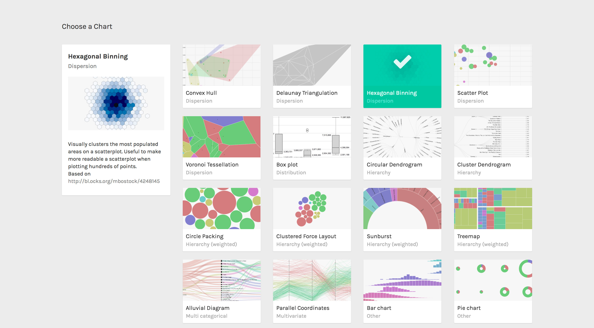
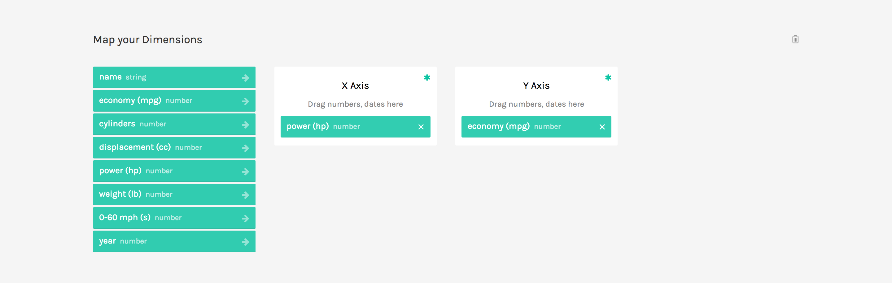

Hexbins layout is a variation of the scatterplot, grouping points in hexagonal areas. The color of each hexagon represents the number of points in it. We will use it to see how cars distribute according to their power and their cosumption.

**GOAL OF THE TUTORIAL**: see where most of the cars contained in the dataset aggregate disposing them by Horsepower and Miles per Gallon.

### 01. Load your data

The first step is to copy and paste your data into RAWGraphs. The dataset must contain at least two columns, one for the X Axis (in our case, Power(hp)) and one for the Y Axis (Economy (mpg)).

You can copy and paste the data from the table below:

<iframe src="https://docs.google.com/spreadsheets/d/1sIdX3ooitM4v552xJhbug8tnlFlcGdB4PZhSb9m9kc0/pubhtml?widget=true&amp;headers=false" width="100%" height="300px"></iframe>

Otherwise, you can load the data from using the “Try our samples” button then choosing “Cars &#8211; Multivariate”.

In few second you should see the green bar saying “406 records in your data have been successfully parsed!”.

### 02. Choose the hexbin layout

After pasting your data, scroll down and select the “hexbin” visual model.

### 03. Map your dimensions

The hexbin layout has two visual variables. 

<table>
<tbody>
<tr>
<td><strong>VARIABLE</strong></td>
<td><strong>TYPE</strong></td>
<td><strong>REQUIRED</strong></td>
<td><strong>MULTIPLE</strong></td>
<td><strong>DESCRIPTION</strong></td>
</tr>
<tr>
<td><strong>X Axis</strong></td>
<td>Number, date</td>
<td>Yes</td>
<td>No</td>
<td>The horizontal position of the circles.</td>
</tr>
<tr>
<td><strong>Y Axis</strong></td>
<td>Number, date</td>
<td>Yes</td>
<td>No</td>
<td>The vertical position of the circles.</td>
</tr>
</tbody>
</table>

Drag and drop the dimensions as following:

- Power (hp) as X Axis;
- Economy (mpg) as Y Axis;

In this way we created a dot for each car in the dataset, disposing it on the cartesian plane according according to its Power (hp) and Economy (mpg).

### 04. Options

To reach the final results we can customize the visualization with some parameters you can find next to the visualization.  
For the hebin the options available are the following:

For the final results we have set the options as following:

<table>
<tbody>
<tr>
<td><strong>OPTION</strong></td>
<td><strong>DESCRIPTION</strong></td>
</tr>
<tr>
<td><strong>Width</strong></td>
<td>Artboard width in pixels</td>
</tr>
<tr>
<td><strong>Height</strong></td>
<td>Artboard height in pixels</td>
</tr>
<tr>
<td><strong>Radius</strong></td>
<td>The radius of the circumscribed circle to the hexagon.</td>
</tr>
<tr>
<td><strong>Set origin at (0,0)</strong></td>
<td>If selected, the scatterplot origin will be set at the zero value for both the axes. If not selected, origin will be set to the minimum value for the two axes.</td>
</tr>
<tr>
<td><strong>color scale</strong></td>
<td>List of uniques values in the dimension mapped as “color”. If set to ordinal, you can set a color for each value. If set to linear, the app will try to find the minimum and maximum value contained in the dimension, and then creating a gradient among those two values.</td>
</tr>
</tbody>
</table>

For the final results we have set the options as following:

- Width to 940 pixels;
- Height to 483 pixels;
- Max Radius to 20 pixels;
- Set color scale to linear and set the minimun value to #e0ecf4 and the maximum to #8856a7

Here is the finished chart. You can export it in svg or png using the download function at the bottom of the page.

