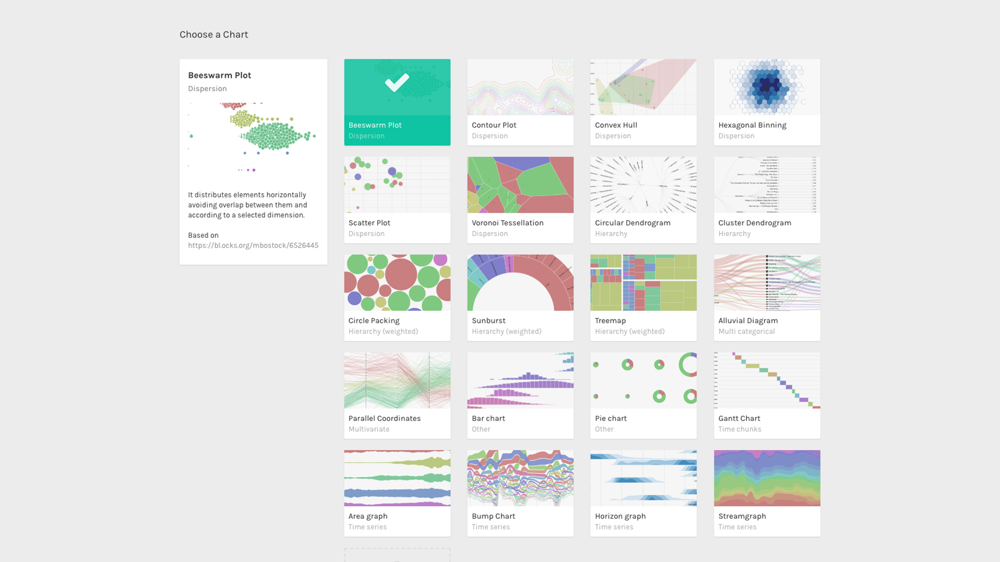

In RAWGraphs, a beeswarm plot allows you to distribute single weighted elements (like circles) on a linear scale, and to divide it also in different categories. This is a useful and easy way to map linear values and to visualize distribution.

It&#8217;s important to keep in mind that a Beeswarm plot uses forces to avoid collision between the single elements of the visual model. While this helps to see all the circles in the visualization, it also creates some cases where **circles are not placed in the exact position** they should be on the linear scale of the X Axis.

**GOAL OF THE TUTORIAL**: see correlation between funding Goals and Pledges in Kickstarter campaigns ending in 2017 from different fields, like Art, Design, Games, Music and Technology.

### 01. Load your data

The first step is to copy and paste your data into RAWGraphs.

The dataset must contain at least one column, which we&#8217;ll use to map values on the X Axis (in our case, Goal USD). Optionally, you can add a column for Groups (Field) that will divide the beeswarm into multiple beeswarms for each group, a column for Radius (Pledges USD), and a column for Color (State).

Last, you can add one last column for Labels (Name).

Here you can see the dataset we are going to use:

<iframe src="https://docs.google.com/spreadsheets/d/e/2PACX-1vQkhBKqfx6RkL-v6aBwazJu96nHQDoirRqgY4Jthy7yWQ20byXkB7mRkToAB4vhKDRvoTXHErNKYcDA/pubhtml?gid=77303400&amp;single=true&amp;widget=true&amp;headers=true" width="100%" height="300"></iframe>

You can also download the dataset through the link on the left of this post or load the data from using the “Try our samples” button then choosing “Kickstarter &#8211; Distribution”.

In few second you should see the green bar saying “460 records in your data have been successfully parsed!”

### 02. Choose the beeswarm plot layout

After pasting your data, scroll down and select the “beeswarm plot” visual model.

### **03. Map your dimensions**

The scatterplot layout has five visual variables. 

<table>
<tbody>
<tr>
<td><strong>VARIABLE</strong></td>
<td><strong>TYPE</strong></td>
<td><strong>REQUIRED</strong></td>
<td><strong>MULTIPLE</strong></td>
<td><strong>DESCRIPTION</strong></td>
</tr>
<tr>
<td><strong>X Axis</strong></td>
<td>Number, date</td>
<td>[fa class=”fa-asterisk”]</td>
<td></td>
<td>The horizontal position of the circles.</td>
</tr>
<tr>
<td><strong>Groups</strong></td>
<td>String</td>
<td></td>
<td></td>
<td>The groups in which circles are divided. If not provided, the circles will be placed on one single line at the center of the canvas.</td>
</tr>
<tr>
<td><strong>Radius</strong></td>
<td>Number</td>
<td></td>
<td></td>
<td>Area of the circles. If not provided, the radius defaults to 2.</td>
</tr>
<tr>
<td><strong>Color</strong></td>
<td>String, numbers, dates</td>
<td></td>
<td></td>
<td>For each unique value found in the dimension, a color is created.</td>
</tr>
<tr>
<td><strong>Label</strong></td>
<td>String, numbers, dates</td>
<td></td>
<td>[fa class=”fa-tags”]</td>
<td>Values will be used as labels.</td>
</tr>
</tbody>
</table>

  It’s time to map your data and create the visualization. On the left you have the list of dimensions in your dataset, on the right the available visual variable of the beeswarm plot layout. 

Drag and drop the dimensions as following:

- Goal USD as X Axis;
- Field as Groups;
- Pledged USD as Size;
- State as Color.

By using Goal USD on the X Axis we distribute single campaigns from the lowest goal to the highest, from left to right. We then divide them in Groups by Field, so we can see if there are any differences in Goals between Art, Technology, Design and so on. By sizing each circle by Pledges USD with their Radius, we see who gathered the highest amount of US Dollars, and using Color to visualize their State we can see which campaigns were successful and which were not.

### 04. Refine and export

To reach the final results we can customize the visualization with some parameters you can find next to the visualization. 

For the beeswarm plot the options available are the following:

<table>
<tbody>
<tr>
<td><strong>OPTION</strong></td>
<td><strong>DESCRIPTION</strong></td>
</tr>
<tr>
<td><strong>Width</strong></td>
<td>Artboard width in pixels.</td>
</tr>
<tr>
<td><strong>Height</strong></td>
<td>Artboard height in pixels.</td>
</tr>
<tr>
<td><strong>Anticollision iterations</strong></td>
<td>The number of iterations to calculate the position of circles in order to avoid overlapping. The higher the number, the more resource consuming but accurate the position and anti-collision algorithm of the circles will be.</td>
</tr>
<tr>
<td><strong>Circles Padding</strong></td>
<td>The padding in px between each circle in the visualization. It defaults to 0,5.</td>
</tr>
<tr>
<td><strong>Vertical Padding</strong></td>
<td>The padding in px between beeswarms created for each group. It’s useful when the high number of elements and their size forces single beeswarm to overlap. It defaults to 0.</td>
</tr>
<tr>
<td><strong>Min Radius</strong></td>
<td>The radius for the circle with the lowest value in the dimension mapped as Radius.</td>
</tr>
<tr>
<td><strong>Max Radius</strong></td>
<td>The radius for the circle with the highest value in the dimension mapped as Radius.</td>
</tr>
<tr>
<td><strong>Colour Scale</strong></td>
<td>List of uniques values in the dimension mapped as “color”. If set to ordinal, you can set a color for each value. If set to linear, the app will try to find the minimum and maximum value contained in the dimension, and then creating a gradient among those two values.</td>
</tr>
</tbody>
</table>

  For the final results we have set the options as following:

- Width to 800 pixels;
- Height to 900 pixels;
- Anticollision Iterations to 1;
- Circles Padding to 0,5;
- Vertical Padding to 0;
- Min Radius to 2;
- Max Radius to 20;
- Set color scale to ‘Ordinal’;
- Set colors as following: 
- canceled #ababab;
- failed #d92e2e;
- successful #69bf86;
- suspended #bfac69.

Here is the finished chart. You can export it in svg or png using the download function at the bottom of the page.

